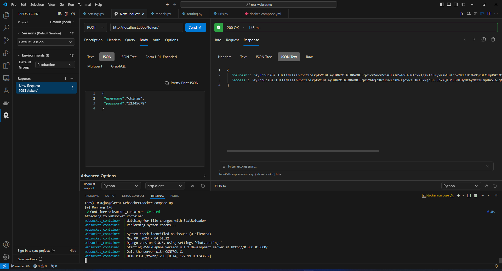
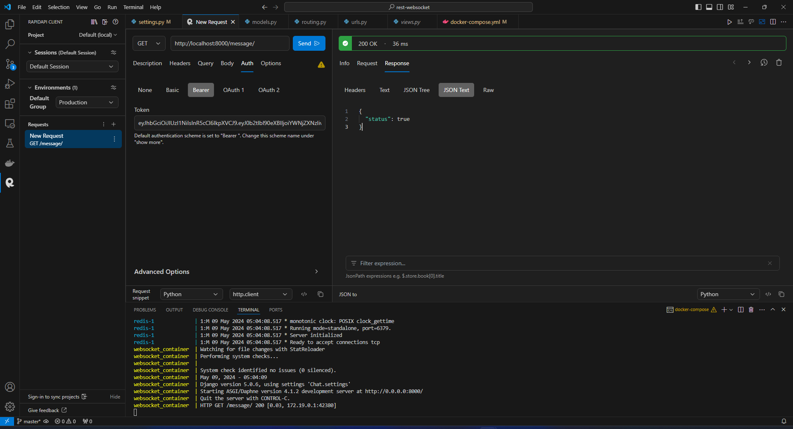
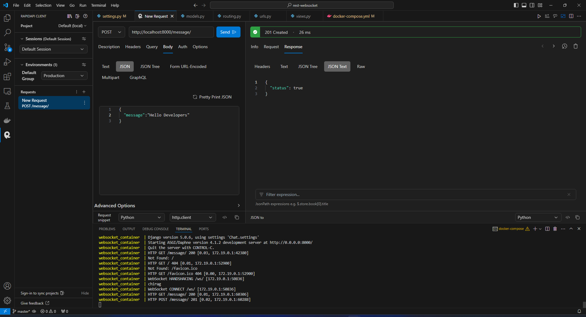

# rest-websocket


## Instructions
* Clone the repository
* Run ```docker-compose build```
* After Running build RUN ```docker-compose up```
* Create a superuser by running ```docker-compose run app python manage.py createsuperuser```
* Now navigate to ```http://localhost:8000``` in the browser to test it out.
* Output
* post request username and password to get token.

* get request on message to check socket connection.

* Post request on message.

* Webscoket message.

